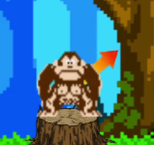
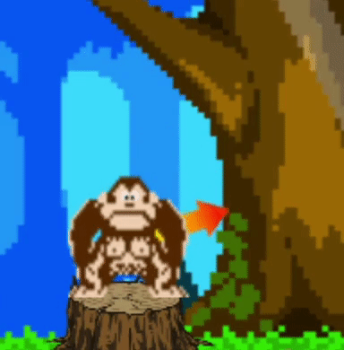
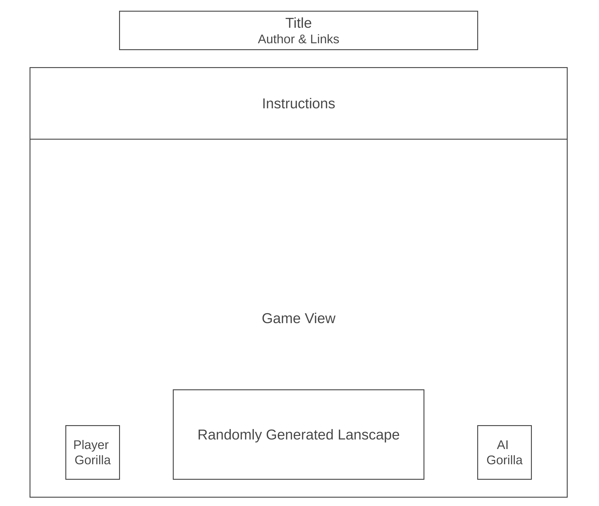

# Gorillas (JavaScript Project)

Welcome to [Gorillas](https://arnobdam.github.io/Gorillas/), my projectile motion game coded via Javascript, HTML & CSS. Gorillas is a projectile motion game involving two rival gorillas throwing bananas at each other. One gorilla is controlled by the user and the other by the computer opponent / AI. The banana's path implements projectile motion physics, including vector math and trigonometry. This game was creating by combining my love of arcade game, physics and computer programming. I hope you enjoy playing!


## Functionality & MVPs

In Gorillas, users will be able to:

1. Determine the angle of the banana thrown via a rotating line guage. Upon hitting the space bar once, the current angle of the gauge will be locked into place.



Rotation code:
```js
function calculateRadians(degree) {
    let radians = degree * (Math.PI / 180);
    return radians;
}

let rotatingUp;
LineGauge.prototype.rotate = function (context) {
    
    context.translate(this.pos[0], this.pos[1]);

    if (this.degree >= 90) {
        rotatingUp = false;
    } else if (this.degree <= 1) {
        rotatingUp = true;
    }

    if (rotatingUp) {
        this.degree++;
        context.rotate(-1 * calculateRadians(this.degree));
    } else {
        this.degree--;
        context.rotate(-1 * calculateRadians(this.degree));
    }

    context.translate(-1 * this.pos[0], -1 * this.pos[1]);
}
```
2. After locking the angle in place, the line gauge will then contiuosly increase and decrease in length. Upon hitting the space bar again, the power of the banana throw will llock in the gorilla will throw the banana!



Power scale code involving vectors & trigonometry, and the implementation of gravity into the banana's y-vector:
```js
let widthIncreasing;
LineGauge.prototype.power = function () {

    if (this.width >= (2 * originalWidth)) {
        widthIncreasing = false;
    } else if (this.width <= originalWidth) {
        widthIncreasing = true;
    }

    if (widthIncreasing) {
        this.width += (originalWidth / 100);
    } else {
        this.width -= (originalWidth / 100);
    }
}

LineGauge.prototype.getVector = function (degree, width) {

    let opposite = (width * Math.sin(calculateRadians(degree))) / 35;
    let adjacent = (width * Math.cos(calculateRadians(degree))) / 35;

    return [adjacent, (-1 * opposite)];
}

Banana.prototype.move = function () {

    this.gravityY += this.gravity;

    this.pos[0] += this.vel[0];
    this.pos[1] += (this.vel[1] + this.gravityY);

}
```
3. Bananas are thrown needing to avoid the raondmly generated landscape generated between themselves and the rival gorilla. If the banana collides with any of the landscape, the game boundaries or the rival gorilla, the turn switches.

Code for the banana colliding each tree in the landscape:
```js
Banana.prototype.hasCollidedWithTree = function (allTrees) {

    let xBanana = this.pos[0];
    let yBanana = this.pos[1];
    let radiusBanana = this.radius;

    let collided = false;

    allTrees.forEach((tree) => {

        let xTree = tree.center[0];
        let yTree = tree.center[1];

        let xDiff = Math.abs(xBanana - xTree);
        let yDiff = Math.abs(yBanana - yTree);

        let xCollDiff = (radiusBanana + (tree.width / 2));
        let yCollDiff = (radiusBanana + (tree.height / 2));

        if (xDiff <= xCollDiff && yDiff <= yCollDiff) {
            collided = true;
        }

    });

    return collided;
}
```
4. The rival gorilla's AI involves pseudo-randomly generating x- and y-vectors which determing the angle and speed of their banana's throw. The AI determine that rival gorilla succeeds with their throw 10-15% of the time.

In addition, this project includes:

1. Instructions detailing how to play the game.
2. Sprites animating the gorillas and bananas, as well as static sprites depicting the landscape, background & lives.
3. An arcade-based CSS style, as well as an animated background in the gameview.

## Wireframe:



## Technologies & Libraries:

- Javascript
- HTML
- CSS
- Canvas API
- Publicly Available Sprite Libraries

## Implementation Timeline 

- Friday afternoon & weekend: Setup project, got webpack up and running. Created all necessary classes, including gorilla, banana, landscape/tree, game and gameview. Created basic canvas shapes representing all the game objects needed and implemented into their proper locations on the canvas. Created the projectile motion code in the banana class. 

- Monday: Create the line guage. Spent the day implementing the rotation and power code. Hooked up the line guage to each gorillas. 

- Tuesday: Used trigonometry to set the banana velocity vector based on the line guage angle and length.Calibrated the velocity values to fit with the banana's projectile motion code. Fixed bugs.

- Wednesday: HTML & CSS day: Create dinstructions and imported arcade title font. Updated all graphics and added sprite animations. Inserted github and linkedin links.

- Thursday morning: Styled CSS to illustrate retro arcade game design. Dynamically adjusted all html divisions and text to resize based on current window size.


